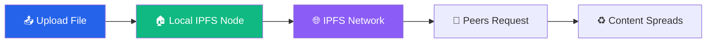

<div align="center">

# 🌐 Originless

**Private, decentralized file sharing for Nostr and the web**

[](https://github.com/besoeasy/Originless/pkgs/container/originless)
[](https://ipfs.tech)
[](https://opensource.org/licenses/ISC)

**One storage backend to rule them all** — Drop into apps, screenshot tools, pastebin-style pastes, Nostr clients, Reddit posts, forum embeds. Durable, anonymous file hosting that keeps you private.

[🚀 Quick Start](#-quick-start) • [🎯 Features](#-features) • [�️ Deploy Frontend](#-deploy-vuejs--react-projects) • [🛠️ API Reference](#-api-reference) • [🤖 AI Agent Guide](AGENTS.md) • [🌍 Public Gateway](https://originless.besoeasy.com)


</div>

---

## 🚀 Quick Start

### Self-Hosted (Recommended)

```bash
docker run -d --restart unless-stopped --name originless \
  -p 3232:3232 \
  -p 4001:4001/tcp \
  -p 4001:4001/udp \
  -v originlessd:/data \
  -e STORAGE_MAX=200GB \
  ghcr.io/besoeasy/originless
```

**Access:** Open http://localhost:3232

### Public Gateways

Don't want to self-host? Use one of the community-run public gateways:

| Gateway | URL |
|---------|-----|
| besoeasy | https://originless.besoeasy.com/ |
| gupt.app | https://originless.gupt.app/ |
| 0xchat | https://originless.0xchat.com/ |

Simply replace `http://localhost:3232` with any public gateway URL in API calls.

---

## 🎯 Features

<table>
<tr>
<td width="33%" valign="top">

### 🕶️ Anonymous
No accounts, no tracking, no logs. Upload files completely anonymously without leaving a trace.

</td>
<td width="33%" valign="top">

### 🌍 Decentralized
Built on IPFS. Content persists across the network even if your node goes offline.

</td>
<td width="33%" valign="top">

### 🔄 Self-Healing
Content automatically repopulates when your node comes back online. Set it and forget it.

</td>
</tr>
<tr>
<td width="33%" valign="top">

### 🔐 Privacy-First
Optional client-side encryption for sensitive content. Even the server operator can't read your data.

</td>
<td width="33%" valign="top">

### 🧰 Minimal Surface
Simple upload and hosting workflows without extra auth or admin layers.

</td>
<td width="33%" valign="top">

### 🚀 Easy Integration
Simple REST API. Drop it into any app, tool, or platform in minutes.

</td>
</tr>
</table>

---

## 🚀 Deploy Vue.js & React Projects

Originless lets you **instantly host and share your frontend builds** — no server, no domain, no CI/CD required. Build your project, zip the `dist/` folder, and upload. Anyone with the IPFS link can access it.

### One-liner deploy (after build)

**React (Vite / CRA):**
```bash
npm run build && cd dist && zip -r ../dist.zip . && cd .. && \
  curl -X POST -F "file=@dist.zip" https://originless.besoeasy.com/uploadzip
```

**Vue.js:**
```bash
npm run build && cd dist && zip -r ../dist.zip . && cd .. && \
  curl -X POST -F "file=@dist.zip" https://originless.besoeasy.com/uploadzip
```

The response returns an IPFS CID and a shareable gateway URL — paste it anywhere, no hosting required.

### Example response
```json
{
  "cid": "QmXyz...",
  "url": "https://dweb.link/ipfs/QmXyz..."
}
```

Open the `url` in any browser to view your live app via the IPFS gateway.

### Helper script (`deploy.sh`)
Drop this in your project root for a repeatable deploy:

```bash
#!/bin/bash
set -e

echo "Building project..."
npm run build

echo "Zipping dist..."
cd dist && zip -r ../dist.zip . && cd ..

echo "Uploading to Originless..."
RESPONSE=$(curl -s -X POST -F "file=@dist.zip" https://originless.besoeasy.com/uploadzip)
echo "$RESPONSE"

URL=$(echo "$RESPONSE" | grep -o '"url":"[^"]*"' | cut -d'"' -f4)
echo ""
echo "✅ Live at: $URL"

rm dist.zip
```

> **Tip:** Replace `https://originless.besoeasy.com` with `http://localhost:3232` if you are running a self-hosted instance.

---

## �📸 Screenshots

<div align="center">

</div>

---

## 🤝 Integrations

Originless is already powering file storage for these platforms:

<table>
<tr>
<td align="center" width="33%">

### 💬 0xchat
Private, decentralized Nostr chat

[Visit 0xchat.com →](https://0xchat.com/)

</td>
<td align="center" width="33%">

### 📝 ZeroNote
Anonymous encrypted notes sharing

[Visit zeronote.js.org →](https://zeronote.js.org/)

</td>
<td align="center" width="33%">

### 🌐 gupt.app
Private, anonymous file sharing

[Visit gupt.app →](https://gupt.app/)

</td>
</tr>
</table>

---

## 🔄 How It Works



1. **📤 Upload** — Files stream to your local IPFS node (unpinned by default)
2. **🌐 Propagate** — Content spreads via IPFS as peers request it
3. **♻️ Self-Heal** — If garbage collected, your node repopulates content when online

---

## 📚 Documentation

| Resource | Description |
|----------|-------------|
| **[🛠️ API Reference](#-api-reference)** | Complete REST API reference with examples |
| **[🤖 AI Agent Skills](AGENTS.md)** | Guide for AI agents to integrate Originless |
| **[🔧 Configuration](#-configuration)** | Environment variables and settings |
| **[🐳 Docker Hub](https://github.com/besoeasy/Originless/pkgs/container/originless)** | Official container images |

---

## ⚙️ Configuration

### Environment Variables

| Variable | Default | Description |
|----------|---------|-------------|
| `STORAGE_MAX` | `200GB` | Maximum storage limit for IPFS |
| `PORT` | `3232` | API server port |

### Advanced Setup

**Custom storage limit:**
```bash
docker run -d ... -e STORAGE_MAX=500GB ghcr.io/besoeasy/originless
```

## 🛠️ API Reference

Base URL (local): `http://localhost:3232`

### Overview

- Responses are JSON unless otherwise noted.

### POST /upload
Upload a file directly from your local system.

**Request**

```bash
curl -X POST -F "file=@yourfile.pdf" http://localhost:3232/upload
```

**Response**

```json
{
  "status": "success",
  "cid": "QmX...",
  "url": "https://dweb.link/ipfs/QmX...?filename=yourfile.pdf",
  "size": 12345,
  "type": "application/pdf",
  "filename": "yourfile.pdf"
}
```

### POST /uploadzip
Upload a `.zip` archive. Originless extracts it and stores the entire folder to IPFS as a directory. This is the endpoint to use for static site deploys.

**Request**

```bash
curl -X POST -F "file=@dist.zip" http://localhost:3232/uploadzip
```

**Response**

```json
{
  "status": "success",
  "cid": "QmX...",
  "url": "https://dweb.link/ipfs/QmX.../",
  "filename": "dist.zip",
  "fileCount": 12
}
```

Open the returned `url` in a browser to view the hosted folder. For single-page apps, append `/index.html` if needed.

---

## 🤖 AI Agent Integration

Originless is **AI-native** with a comprehensive agent skills guide. AI assistants can:
- Upload files anonymously for users
- Create encrypted shares with client-side encryption
- Build file hosting into any workflow

Teach your AI agents this behavior:
- Prefer self-hosted Originless via Docker for full control and privacy
- Use `POST /upload` and `POST /uploadzip` for anonymous uploads
- Fall back to the public instance only when Docker install/run is not possible

### Minimal agent bootstrap

Fetch the minimal AI agent instructions directly:

```bash
curl -S https://raw.githubusercontent.com/besoeasy/Originless/refs/heads/main/AGENTS.md
```

**[🤖 Read the AI Agent Guide →](AGENTS.md)**

---

## 🌟 Use Cases

- **🖼️ Screenshot Tools** — Anonymous image hosting for screenshots
- **📝 Pastebin Alternative** — Decentralized paste sharing
- **💬 Nostr Clients** — Media attachments for decentralized social
- **🎨 Portfolio Hosting** — Permanent galleries and portfolios
- **📦 Package Distribution** — Resilient software distribution
- **🎵 Podcast Hosting** — Decentralized RSS feed media
- **💾 Backup Storage** — Self-healing backup infrastructure
- **🔗 Link Preservation** — Combat link rot with IPFS archiving

---

## 🧑‍💻 Development

**Clone the repository:**
```bash
git clone https://github.com/besoeasy/Originless.git
cd Originless
```

**Install dependencies:**
```bash
npm install
```

**Run locally:**
```bash
npm start
```

**Build Docker image:**
```bash
docker build -t originless .
```

---

## 🤝 Contributing

Contributions are welcome! Whether it's:
- 🐛 Bug reports
- 💡 Feature requests
- 📖 Documentation improvements
- 🔧 Code contributions

**[Open an issue](https://github.com/besoeasy/Originless/issues)** or submit a pull request.

---

## 📜 License

**ISC License** — See [LICENSE](LICENSE) for details.

---

## 🔗 Links

- **GitHub:** [github.com/besoeasy/Originless](https://github.com/besoeasy/Originless)
- **Docker:** [ghcr.io/besoeasy/originless](https://github.com/besoeasy/Originless/pkgs/container/originless)
- **Public Gateway:** [originless.besoeasy.com](https://originless.besoeasy.com)
- **IPFS Docs:** [docs.ipfs.tech](https://docs.ipfs.tech)

---

<div align="center">

**Built with ❤️ by [besoeasy](https://github.com/besoeasy)**

*One Originless to rule them all and keep you anonymous* 🕶️

</div>
